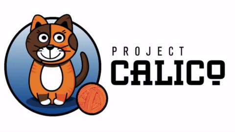

# Calico Community

Calico is an open source project with an active development and user community. We encourage you to connect and take part!

## Community Meetings
The Calico maintainers host a monthly online community meeting where everyone is welcome. 

* [Community Event Calendar](
https://calendar.google.com/calendar/embed?src=tigera.io_uunmavdev5ndovf0hc4frtl0i0%40group.calendar.google.com) (google calendar)
* [Zoom Meeting](https://zoom.us/j/270294702) (additional dial in details in calendar)
* [Meeting Details](
https://docs.google.com/document/d/1b6-ZS7UmRP_-XDq4XnlaKyb7lW9xbnzJ4mt5JK7ASHY/) (agenda, minutes, and recordings)

## Slack

The Calico Users [slack group](https://slack.projectcalico.org) is a great place to get community support or connect with  other users and Calico developers. 

## Contributing

Join the other Calico heroes by contributing to the project. Everything from a new feature through to a one character docs fix is welcome.

To get started, read this [guide](https://github.com/projectcalico/calico/blob/master/CONTRIBUTING_CODE.md). We encourage you to connect with other contributors and maintainers in the `#contributors` channel in the Calico Users [slack group](https://slack.projectcalico.org)

If you are looking for open github issues to potentially help work on, these filters are a good starting point:

* First time contributor help wanted [issues](https://github.com/issues?utf8=%E2%9C%93&q=is%3Aopen+user%3Aprojectcalico+label%3A%22good-first-issue%22+)
* Full list of help wanted [issues](https://github.com/issues?utf8=%E2%9C%93&q=is%3Aopen+user%3Aprojectcalico+label%3A%22help+wanted%22+)

## Code of Conduct

We are dedicatee to providing a welcoming and harassment-free experience for everyone. We ask that our users and contributors take a few minutes to review our [code of conduct](CODE_OF_CONDUCT.md).

## Acknowledgments

Calico was originally created by the team at tigera.io. A very special thanks to the [long list of people](https://github.com/projectcalico/calico/blob/master/AUTHORS.md) who have contributed to and helped maintain the project. Additional thanks to all the Calico enthusiasts who have helped spread the word about Calico.  It's the breadth of this community that has helped make Calico what it is today!

